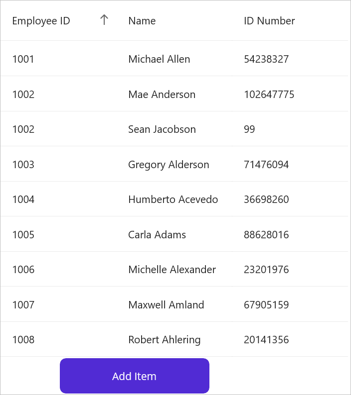

# How-to-apply-sorting-for-the-new-items-added-in-.NET-MAUI-DataGrid-SfDataGrid-
Sorting can be applied to new items added in [SfDataGrid](https://www.syncfusion.com/maui-controls/maui-datagrid) by setting the [LiveDataUpdateMode](https://help.syncfusion.com/cr/maui/Syncfusion.Maui.DataGrid.SfDataGrid.html#Syncfusion_Maui_DataGrid_SfDataGrid_LiveDataUpdateMode) property to AllowDataShaping.

##### xaml:
 
 ```XML
 <Grid RowDefinitions="*,50">
    <syncfusion:SfDataGrid  x:Name="dataGrid" 
                            ItemsSource="{Binding Employees}"
                            Grid.Row="0"
                            AutoGenerateColumnsMode="None"
                            LiveDataUpdateMode="AllowDataShaping"
                            SortingMode="Single"
                            DefaultColumnWidth="155">
        <syncfusion:SfDataGrid.Columns>
            <syncfusion:DataGridTextColumn MappingName="EmployeeID"
                                           HeaderText="Employee ID" />
            <syncfusion:DataGridTextColumn MappingName="Name"
                                           HeaderText="Name" />
            <syncfusion:DataGridTextColumn MappingName="IDNumber"
                                           HeaderText="ID Number" />
        </syncfusion:SfDataGrid.Columns>

    </syncfusion:SfDataGrid>
    <Button Clicked="Button_Clicked"
            WidthRequest="200"
            HorizontalOptions="Start"
            Margin="80,0,0,3"
            Grid.Row="1"
            Text="Add Item" />
</Grid>
 ```
 

##### xaml.cs:
 
 ```XML
private void Button_Clicked(object sender, EventArgs e)
{
    viewModel.Employees.Add(new Employee()
    {
        EmployeeID = "1002",
        Name = "Sean Jacobson",
        IDNumber = 99,
        ContactID = 199,
        ManagerID = 2,
        LoginID = "sean2",
        Gender = "Male",
        Title = "GM",
        MaritalStatus = "Single",
        HireDate = new DateTime(2023, 01, 03),
        BirthDate = new DateTime(2023, 01, 03),
        SickLeaveHours = 14,
        Salary = 5999,
        EmployeeStatus = true,
        Rating = 1,
    });
}
 ```
 

Executing the code example above yields the following output.



[View sample in GitHub](https://github.com/SyncfusionExamples/How-to-apply-sorting-for-the-new-items-added-in-.NET-MAUI-DataGrid-SfDataGrid/tree/master)

Take a moment to explore this [documentation](https://help.syncfusion.com/maui/datagrid/overview), where you can find more information about Syncfusion .NET MAUI DataGrid (SfDataGrid) with code examples. Please refer to this [link](https://www.syncfusion.com/maui-controls/maui-datagrid) to learn about the essential features of Syncfusion .NET MAUI DataGrid (SfDataGrid).

##### Conclusion

I hope you enjoyed learning about how to apply Alternate Row Color in .NET MAUI DataGrid (SfDataGrid).

You can refer to our [.NET MAUI DataGrid’s feature tour](https://www.syncfusion.com/maui-controls/maui-datagrid) page to learn about its other groundbreaking feature representations. You can also explore our [.NET MAUI DataGrid Documentation](https://help.syncfusion.com/maui/datagrid/getting-started) to understand how to present and manipulate data. 
For current customers, you can check out our .NET MAUI components on the [License and Downloads](https://www.syncfusion.com/sales/teamlicense) page. If you are new to Syncfusion, you can try our 30-day [free trial](https://www.syncfusion.com/downloads/maui) to explore our .NET MAUI DataGrid and other .NET MAUI components. 

If you have any queries or require clarifications, please let us know in the comments below. You can also contact us through our [support forums](https://www.syncfusion.com/forums), [Direct-Trac](https://support.syncfusion.com/create) or [feedback portal](https://www.syncfusion.com/feedback/maui?control=sfdatagrid), or the feedback portal. We are always happy to assist you!
